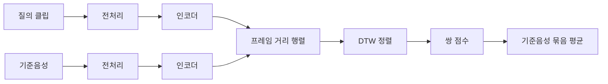

SSL DTW는 앵무새가 보호자의 단어를 따라 했는지 판정하는 방법이다.
고도화 Phase 1에서 사전학습 음성 인코더 9개를 같은 조건에서 비교해 ContentVec 레이어 8을 채택했다.

## 요약

- **채택 인코더: ContentVec 레이어 8**
  - 채택 기준: non\_speech 분리 AUC와 단어 구분 AUC의 평균(4b)
  - 4b: full 0.802, subsequence 0.804, 두 DTW 모드 모두 3위
  - ContentVec보다 4b가 신뢰구간 밖으로 높은 인코더 없음
  - 단어 구분 AUC: full 2위, subsequence 1위
- `서로 다른 단어 mimic 구분`**이** `non_speech vs mimic` **분리보다 약함**
  - non\_speech 분리 최고: 0.924
  - 단어 구분 최고: 0.755
- **한국어 학습 효과 미확인**
  - 한국어를 학습한 인코더 4개도 단어 구분이 ContentVec보다 일관되게 높지 않음

그림 1. 인코더별 non_speech 분리, 단어 구분, 채택 기준의 AUC. 오차 막대는 95% 신뢰구간이다.

---

## 0. 용어

| 용어                   | 뜻                                             |
| -------------------- | --------------------------------------------- |
| mimic                | 앵무새가 단어를 따라 한 클립                              |
| non speech           | 단어를 따라 하려는 시도가 아닌 앵무새 소리                      |
| 보호자 기준음성 (reference) | 보호자가 녹음한 목표 단어 음성. 이하 기준음성                    |
| trial                | 질의 1개를 단어 w의 기준음성 묶음과 비교해 점수 1개를 계산하는 시행      |
| positive             | 단어 w의 mimic을 단어 w의 기준음성과 비교한 trial            |
| negative             | 단어 w의 mimic이 아닌 오디오를 단어 w의 기준음성과 비교한 trial    |
| 가정                   | 같은 새, 같은 집, 같은 마이크를 공유하는 클립 묶음                |
| recall@FAR 5%        | negative의 5% 이하만 통과하는 임계값에서 positive가 통과하는 비율 |

---

## 1. 목표

> buddybird 앱의 앵무새가 보호자의 단어를 따라 했는지 판정하는 기능을 개발한다.

채택한 방법론은 SSL + DTW다. 앵무새 소리를 목표 단어의 보호자 기준음성과 비교해 유사도 점수를 계산한다.

1. Phase 1: 인코더 후보를 같은 조건에서 비교해 1개 채택
2. Phase 2: 채택 인코더로 DTW 모드와 판정 임계값 결정

Phase 1은 임계값을 정하지 않는다. AUC는 positive와 negative의 점수 순위만으로 계산하므로 임계값 없이 인코더의 분리 능력을 비교할 수 있다.

## 2. 실험 설계

### 2-1. 점수 계산

| 단계       | 고정 값                                    |
| -------- | --------------------------------------- |
| 전처리      | 16kHz 모노, 앞뒤 무음 트리밍, peak 진폭 정규화        |
| 인코더 출력   | 가중치를 고정한 사전학습 모델의 중간 레이어 출력, 클립 단위 CMVN |
| 프레임 거리   | cosine                                  |
| 쌍 점수     | DTW 누적 비용을 경로 길이로 나눈 값에 음수 부호           |
| trial 점수 | 단어 w의 기준음성 여러 개와 계산한 쌍 점수의 평균           |

DTW는 두 모드를 모두 계산한다.

| 모드          | 정렬 방식                   | 유리한 질의                |
| ----------- | ----------------------- | --------------------- |
| full        | 질의 전체를 기준음성 전체와 정렬      | 질의가 단어 w 하나뿐인 경우      |
| subsequence | 기준음성 전체를 질의 안의 한 구간에 정렬 | 질의 안 어딘가에 단어 w가 있는 경우 |

### 2-2. 비교 인코더

| 인코더                      | 모델                              | 학습 언어   | 레이어   |
| ------------------------ | ------------------------------- | ------- | -----: |
| ContentVec               | `lengyue233/content-vec-best`   | 영어      | 8     |
| HuBERT                   | `facebook/hubert-base-ls960`    | 영어      | 2     |
| wav2vec 2.0              | `facebook/wav2vec2-base`        | 영어      | 4     |
| Whisper small encoder    | `openai/whisper-small`          | 다국어     | 11    |
| MFCC                     | 13차 MFCC와 Δ                     | 해당 없음   | 해당 없음 |
| HuBERT 한국어               | `team-lucid/hubert-base-korean` | 한국어     | 8     |
| mHuBERT-147              | `utter-project/mHuBERT-147`     | 147개 언어 | 10    |
| w2v-BERT 2.0             | `facebook/w2v-bert-2.0`         | 다국어     | 4     |
| Whisper large-v3 encoder | `openai/whisper-large-v3`       | 다국어     | 24    |

- MFCC: 사전학습 인코더의 이득을 확인하는 대조군
- 한국어 학습 인코더 4개: 한국어 학습이 단어 구분을 높이는지 확인하기 위해 추가
  - HuBERT 한국어와 mHuBERT-147은 ContentVec과 구조와 크기가 같고 학습 언어만 다름
- 레이어: 이전 데이터에서 인코더마다 여러 레이어를 평가해 4b가 가장 높았던 레이어 1개를 고정

### 2-3. 데이터

| 구분          | 건수     | 가정 수 |
| ----------- | ------: | ----: |
| mimic       | 1,332  | 102  |
| non\_speech | 32,919 | 123  |
| 보호자 기준음성    | 392    | 66   |

- non speech: 표본 추출 없이 전수 사용
- 제외 대상: 대형 앵무 5종의 mimic, non_speech, 해당 가정의 기준음성
- 발음이 부정확하다고 표시된 mimic: positive에서 제외
- 주 단어(positive 30건 이상): 안녕 865, 안녕하세요 100, 사랑해 75, 까꿍 30. 결론은 주 단어로만 판단

### 2-4. 기준음성 구성

| 구성      | 사용하는 기준음성                 | 재현하는 상황                      |
| ------- | ------------------------- | ---------------------------- |
| pooled  | 질의 가정을 제외한 다른 가정의 기준음성 전부 | 보호자 녹음이 없는 단어를 다른 사람 목소리로 판정 |
| own-ref | 질의 가정의 기준음성만              | 질의 가정의 보호자 목소리와 비교           |

채택 기준은 표본과 주 단어가 더 많은 pooled에서 계산한다.

### 2-5. 평가 항목

| #   | 항목                                            | positive                | negative                                              | 목적                                                  |
| --- | --------------------------------------------- | ----------------------- | ----------------------------------------------------- | --------------------------------------------------- |
| 1   | mimic vs non\_speech                          | 모든 단어 w의 positive를 합친 것 | non\_speech를 각 단어 w의 기준음성(reference)과 비교한 trial을 합친 것 | mimic과 non\_speech 사이에 음향학적 차이가 인코더를 통해 구분되는가       |
| 2   | 각 단어 mimic vs non\_speech                     | 단어 w의 positive          | non\_speech를 w의 기준음성(reference)과 비교한 trial            | 단어 w의 mimic과 non\_speech 사이의 음향학적 차이가 인코더를 통해 구분되는가 |
| 3   | 각 단어 mimic vs 다른 단어 mimic                     | 단어 w의 positive          | 다른 단어 mimic을 w의 기준음성(reference)과 비교한 trial            | 서로 다른 단어의 mimic 사이의 음향학적 차이가 인코더를 통해 구분되는가          |
| 4   | 각 단어 mimic vs (다른 단어 mimic &amp; non\_speech) | 단어 w의 positive          | 항목 2와 항목 3의 negative 전부                               | 실제 입력 전체에서 단어 w가 구분되는가                              |

항목 4는 두 값으로 계산한다.

- 4a: 항목 2와 항목 3의 negative를 그대로 합산한 AUC
  - non_speech가 다른 단어 mimic보다 약 25~110배 많아 사실상 항목 2와 같은 값
- 4b: 항목 2 AUC와 항목 3 AUC의 평균
  - non_speech 분리와 단어 구분을 같은 비중으로 보기 때문에 채택 기준으로 사용

### 2-6. 채택 규칙

1. pooled 4b의 주 단어 평균이 가장 높은 인코더
2. 1위와 2위의 신뢰구간이 겹치면 항목 3이 높은 인코더
3. 그래도 겹치면 recall@FAR 5%, 그다음 비용 순
4. DTW 모드는 선택하지 않고 두 모드 결과를 모두 보고

---

## 3. 실험 결과

### 3-1. 종합 성능

| 인코더              | full 항목 2 | full 항목 3 | full 4b   | subsequence 항목 2 | subsequence 항목 3 | subsequence 4b |
| ---------------- | ---------: | ---------: | ---------: | ----------------: | ----------------: | --------------: |
| ContentVec       | 0.860     | 0.744     | 0.802     | 0.860            | **0.747**        | 0.804          |
| HuBERT           | 0.855     | 0.702     | 0.778     | 0.851            | 0.693            | 0.772          |
| wav2vec 2.0      | 0.851     | 0.655     | 0.753     | 0.806            | 0.657            | 0.732          |
| Whisper small    | 0.859     | 0.697     | 0.778     | 0.881            | 0.702            | 0.792          |
| MFCC             | 0.814     | 0.625     | 0.720     | 0.657            | 0.591            | 0.624          |
| HuBERT 한국어       | 0.862     | **0.755** | **0.808** | 0.783            | 0.732            | 0.758          |
| mHuBERT-147      | 0.881     | 0.727     | 0.804     | 0.887            | 0.740            | 0.814          |
| w2v-BERT 2.0     | **0.884** | 0.669     | 0.776     | 0.900            | 0.670            | 0.785          |
| Whisper large-v3 | 0.882     | 0.680     | 0.781     | **0.924**        | 0.714            | **0.819**      |

값은 pooled 구성, 주 단어 평균 AUC다. 굵은 글씨는 열의 최댓값이다.

- non_speech 분리: 다국어 대형 모델인 Whisper large-v3, w2v-BERT 2.0, mHuBERT-147이 가장 높음
- 단어 구분: ContentVec과 HuBERT 한국어가 가장 높고, 다국어 대형 모델은 0.67~0.74
- 4b: 1위가 모드마다 다름. full 1위 HuBERT 한국어, subsequence 1위 Whisper large-v3

### 3-2. 채택 판정

같은 재표집 표본으로 계산한 4b 차이(해당 인코더 − ContentVec)는 다음과 같다.

| 모드          | 인코더              | 4b 차이      | 짝지은 95% 신뢰구간         |
| ----------- | ---------------- | ----------: | -------------------- |
| full        | HuBERT 한국어       | +0.006     | -0.017 \~ +0.028     |
| full        | mHuBERT-147      | +0.002     | -0.019 \~ +0.020     |
| subsequence | Whisper large-v3 | +0.015     | -0.022 \~ +0.046     |
| subsequence | mHuBERT-147      | +0.010     | -0.016 \~ +0.033     |
| subsequence | HuBERT 한국어       | **-0.046** | **-0.076 \~ -0.014** |

ContentVec보다 4b가 신뢰구간 밖으로 높은 인코더는 없다. 규칙 2(항목 3)에서 ContentVec은 full 2위, subsequence 1위다.
full 1위인 HuBERT 한국어는 subsequence에서 7위이고 ContentVec보다 구간 밖으로 낮다. 두 모드 모두에서 상위인 ContentVec을 채택했다.

그림 2. 인코더별 4b(위)와 항목 3(아래) AUC와 95% 신뢰구간. pooled 구성, 주 단어 평균이다.

### 3-3. 한국어 학습 효과

구조와 크기가 같고 학습 언어만 다른 세 모델의 항목 3은 다음과 같다.

| 모드          | ContentVec 영어 | HuBERT 한국어 | mHuBERT-147 다국어 |
| ----------- | -------------: | ----------: | ---------------: |
| full        | 0.744         | 0.755      | 0.727           |
| subsequence | 0.747         | 0.732      | 0.740           |

한국어를 학습한 모델이 일관되게 높지 않다.
Whisper를 small에서 large-v3로 키우면 non_speech 분리만 상승하고(subsequence 0.881 → 0.924) 항목 3은 거의 같다(0.702 → 0.714).
학습 언어와 모델 크기는 단어 구분을 결정하는 요인이 아니다.

### 3-4. 단어별 성능

| 단어    | 항목 3 범위    | 특징                                                  |
| ----- | ---------- | --------------------------------------------------- |
| 까꿍    | 0.83\~0.94 | 가장 쉬움. 30건, 10가정이라 신뢰구간이 넓음                         |
| 안녕하세요 | 0.54\~0.81 | ContentVec full 0.81로 최고                            |
| 사랑해   | 0.46\~0.74 | HuBERT 한국어 full 0.74로 최고                            |
| 안녕    | 0.42\~0.70 | ContentVec 0.68~~0.70, Whisper 계열 0.50~~0.57로 우연 수준 |

### 3-5. 운영점 근처 성능

AUC는 전 구간의 평균이라 운영점인 낮은 오통과율 구간의 우열과 다를 수 있다.

| negative              | 최고 인코더           | full  | subsequence |
| --------------------- | ---------------- | -----: | -----------: |
| non\_speech와 다른 단어 합산 | Whisper large-v3 | 0.652 | 0.682       |
| 다른 단어만                | ContentVec       | 0.402 | 0.415       |

다른 단어 mimic을 5%만 통과시키는 임계값에서는 positive의 절반 이상이 임계값을 넘지 못한다.

### 3-6. 단어 구분이 어려운 이유

그림 3. '안녕' 기준음성과 비교한 범주별 trial 점수 분포. pooled 4b 상위 4개 인코더와 MFCC 대조군이다.

non_speech(회색)는 낮은 점수 구간에 분포해 positive와 일부 분리되지만, 다른 단어 mimic(주황)은 positive와 거의 겹친다.
앵무새가 단어를 따라 한 소리는 단어가 달라도 서로 비슷한 점수를 받는다.
발음이 부정확한 mimic(분홍)도 positive와 겹쳐, 발음 정확도 구분은 모든 인코더에서 우연 수준이다(AUC 0.42~0.62).

### 3-7. 포함 관계

'안녕하세요'를 따라 한 앵무새는 '안녕'도 말한 것이다.
기준음성 단어를 포함한 더 긴 mimic을 확장 mimic, 기준음성 단어의 일부만 말한 mimic을 부분 mimic이라 부른다.
아래 AUC가 0.5면 positive와 같은 점수대, 0.5보다 크면 positive보다 낮은 점수다.

| 상황                          | ContentVec full | ContentVec subsequence |
| --------------------------- | ---------------: | ----------------------: |
| '안녕' 기준음성과 확장 mimic         | 0.676           | 0.506                  |
| '안녕하세요' 기준음성과 부분 mimic '안녕' | 0.817           | 0.787                  |

- 부분 mimic: 모든 인코더와 모드에서 positive보다 낮은 점수
- 확장 mimic: full은 positive보다 낮은 점수, subsequence는 positive와 같은 점수대

확장 mimic을 성공으로 판정할지에 따라 Phase 2의 DTW 모드 선택이 달라진다.

### 3-8. 기준음성 화자

own-ref 기준음성이 있는 같은 질의(안녕, 480건, 30가정)를 두 구성으로 채점해 비교했다.

| 인코더              | 모드          | 항목 3 pooled → own-ref |
| ---------------- | ----------- | --------------------- |
| ContentVec       | subsequence | 0.767 → 0.752         |
| Whisper small    | full        | 0.518 → 0.669         |
| Whisper large-v3 | subsequence | 0.605 → 0.729         |

ContentVec은 다른 가정의 목소리로 비교해도 항목 3 차이가 작고, Whisper 계열은 같은 가정의 목소리일 때 0.12~0.19 상승한다.
보호자 녹음이 없는 단어를 다른 가정 녹음으로 판정해야 하는 경우 화자 차이의 영향이 작은 ContentVec이 유리하다.
대부분의 차이는 신뢰구간이 0을 포함해 방향만 확인할 수 있다.

---

## 4. 한계

- **레이어 선택 편향**: 레이어는 이전 데이터에서 선택했고, 이전 데이터 클립 대부분이 이번 평가에도 포함됨
- **낮은 단어 구분 성능**: 항목 3 최고 0.755. 인코더 교체로 올릴 근거가 없음
- **주 단어 구성 변화**: ContentVec full 4b가 0.8을 넘은 원인은 까꿍 추가. 이전과 같은 주 단어 3개로는 0.774
- **own-ref 표본 부족**: 주 단어 2개, 신뢰구간 폭 0.16~0.32
- **분할 없음**: dev와 test를 나누지 않고 전체 데이터로 평가

---

## 5. 결론

### 5-1. 최종 인코더

> **ContentVec 레이어 8을 최종 인코더로 결정**

- 종합 성능(4b)에서 ContentVec보다 신뢰구간 밖으로 높은 인코더가 없다. 
- 서비스의 핵심 능력인 단어 구분(항목 3)에서 ContentVec이 full 2위, subsequence 1위이고, 다른 단어 mimic의 오통과율을 5%로 묶었을 때의 recall도 가장 높다(0.40~0.42).
- 화자 차이에 둔감하다. 다른 가정의 보호자 목소리로 비교해도 항목 3이 거의 떨어지지 않아, 보호자 녹음이 없는 프리셋 단어 판정에도 같은 인코더를 쓸 수 있다. 추출 비용도 Whisper 계열의 13분의 1이다.

대안으로 검토한 인코더는 다음 이유로 채택하지 않는다.

| 인코더              | 장점                                                | 채택하지 않는 이유                                             |
| ---------------- | ------------------------------------------------- | ------------------------------------------------------ |
| mHuBERT-147      | own-ref에서 4b 1위(0.823 / 0.839), non\_speech 분리 우수 | 비상업 라이선스(CC-BY-NC-SA 4.0)로 서비스 탑재 불가                   |
| Whisper large-v3 | subsequence 4b 1위, non\_speech 분리 최고(0.924)       | 안녕의 단어 구분이 우연 수준(0.50\~0.57), 자기 보호자 목소리에 의존, 추출 비용이 큼 |
| HuBERT 한국어       | full 4b와 항목 3 1위                                  | subsequence에서 7위로 떨어지고 ContentVec보다 구간 밖으로 낮음.         |

### 5-2. 예상 성능

AUC는 임계값 없이 계산한 분리 능력이므로, 임계값을 정해 성공과 실패를 판정하는 최종 구현의 성능은 이보다 낮다. ContentVec 레이어 8의 수치로 추정하면 다음과 같다.

| 상황                             | AUC(4b)    | non\_speech 분리 AUC | 단어 구분 AUC  | recall@FAR 5% |
| ------------------------------ | ----------: | ------------------: | ----------: | -------------: |
| 다른 가정 기준음성(pooled, 프리셋 단어 상황)  | 0.80       | 0.86               | 0.74       | 0.59          |
| 자기 가정 기준음성(own-ref, 보호자 녹음 상황) | 0.71\~0.77 | 0.68\~0.74         | 0.75\~0.80 | 0.20\~0.26    |

- **own-ref의 non_speech 분리가 pooled보다 낮은 원인은 negative 구성이다.** 같은 가정의 non_speech는 기준음성과 녹음 환경을 공유해 점수가 올라가고, 가정당 기준음성이 1~2개뿐인 곳이 많아 평균의 분산이 크다. 보호자 녹음 개수(1, 3, 5개)에 따른 성능은 Phase 2에서 확인한다.

### 5-3. 남은 과제

- 인코더를 바꿔 단어 구분을 올릴 여지는 작다. 학습 언어, 크기, 학습 방식이 다른 9개 인코더의 항목 3이 모두 0.76 이하다. 다음 후보는 음소 사후확률 기반 비교와 클립 여러 개를 묶는 판정이다.
- Phase 2에서 정할 것은 DTW 모드(확장 mimic을 성공으로 볼지), 임계값과 점수 정규화, 기준음성 개수, 그리고 임계값을 정하는 데이터와 최종 수치를 내는 데이터의 분리다.
